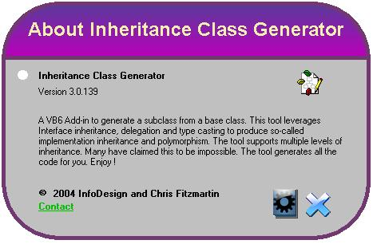



## Screen Shaper \-\- Button Shaper \-\- About Screen

### Description

This code allows you to easily create shaped forms and buttons. All the complexity is hidden behind the scenes so that ultimately it only takes 1 line of code to make a form, button, or picturebox take on the complex shape of a picture. The code is ready to be plugged right into a project.

An example application is included that is itself pretty cool. It is a little framework for creating "About Screens." The screen shot is an example of what a few lines of code get you.

A second example app allows you to dynamically create shaped forms by selecting a file name. Just good clean fun.

Some of the Win32 API code came from another PSC submission. Don't know who. But thanks !
 
### More Info
 

             |
---                |---
**Submitted On**   |2004-05-05 18:49:20
**By**             |[chris fitzmartin](https://github.com/Planet-Source-Code/PSCIndex/blob/master/ByAuthor/chris-fitzmartin.md)
**Level**          |Intermediate
**User Rating**    |5.0 (20 globes from 4 users)
**Compatibility**  |VB 4\.0 \(32\-bit\), VB 5\.0, VB 6\.0
**Category**       |[Graphics](https://github.com/Planet-Source-Code/PSCIndex/blob/master/ByCategory/graphics__1-46.md)
**World**          |[Visual Basic](https://github.com/Planet-Source-Code/PSCIndex/blob/master/ByWorld/visual-basic.md)
**Archive File**   |[Screen\_Sha174234562004\.zip](https://github.com/Planet-Source-Code/chris-fitzmartin-screen-shaper-button-shaper-about-screen__1-53589/archive/master.zip)

